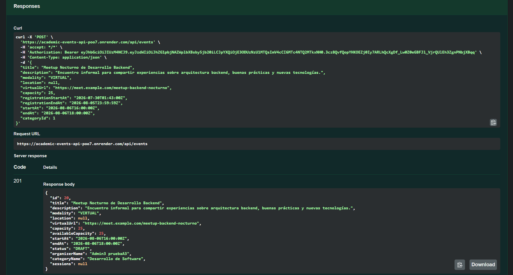
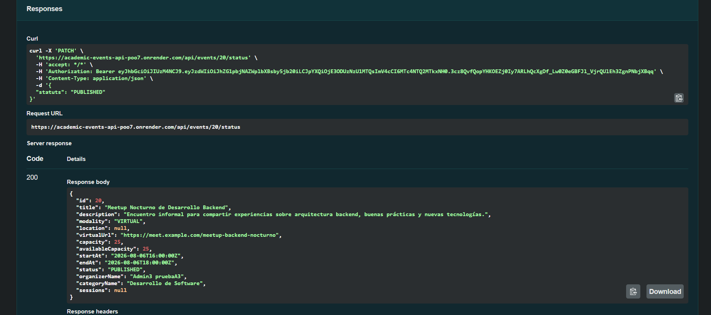
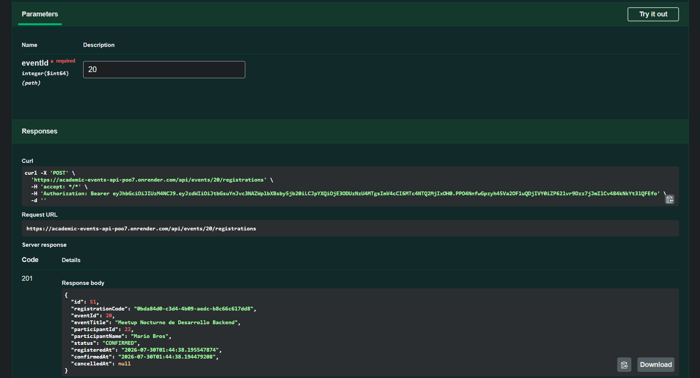
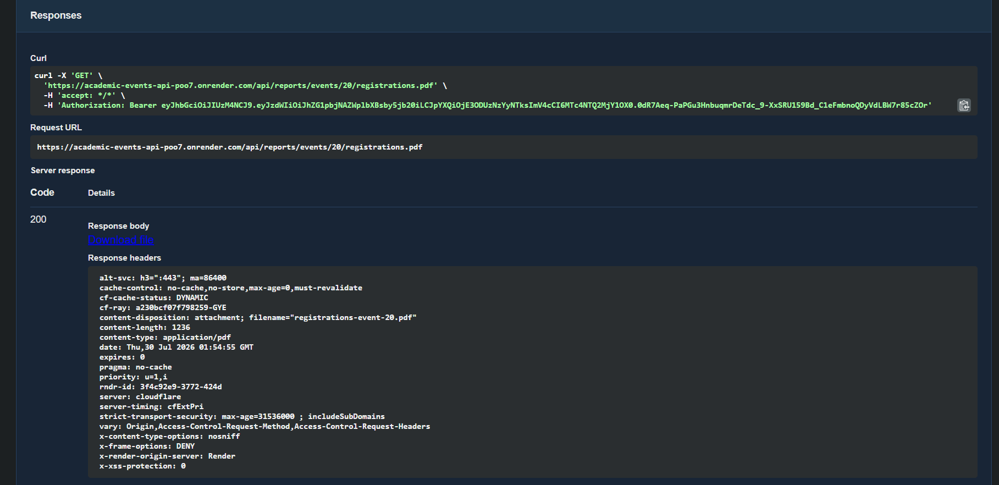
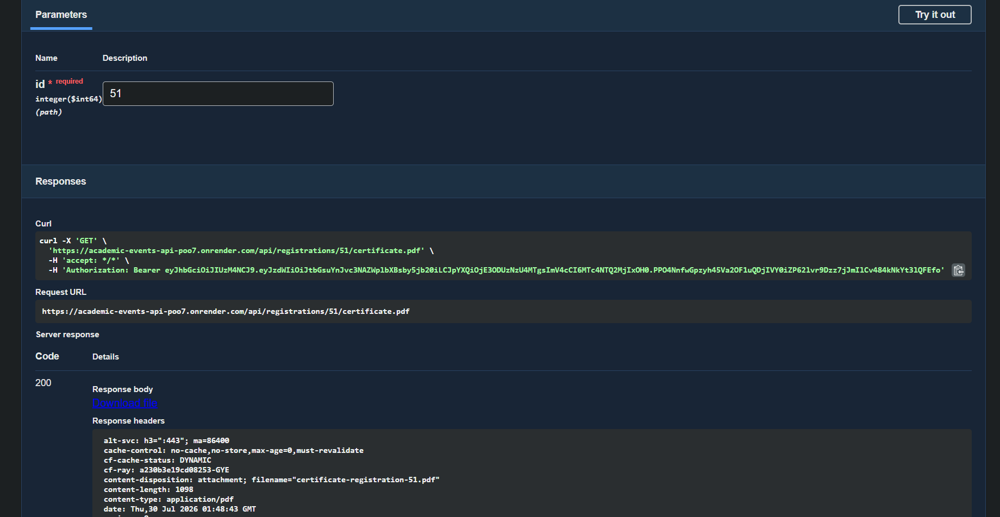
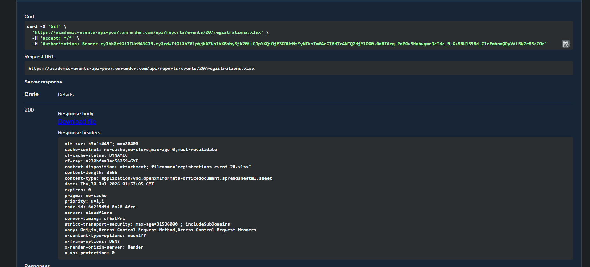

# PROYECTO INTEGRADOR - PPW1

## Integrantes

- Sebastián Gómez
- Isaac Mora
- Jorge Pizarro

## Descripción

Proyecto integrador desarrollado con Spring Boot. La aplicación proporciona una
API REST estructurada de forma modular para la gestión de usuarios, categorías,
eventos, registros y reportes. Incorpora seguridad mediante JWT y protección de
endpoints (Rate Limiting) apoyada en Redis.

## Instalación y Requisitos Previos

- Java 17 (o superior).
- Gradle (se puede utilizar el wrapper incluido `./gradlew`).
- Docker y Docker Compose (para levantar la base de datos y Redis).
- Python 3 (opcional, para ejecutar el script auxiliar de pruebas de rate limiting).

Clonar el repositorio:

```bash
git clone https://github.com/SebastianGomez0910/icc-ProyectoIntegrador.git
cd icc-ProyectoIntegrador
```

## Variables de Entorno

El proyecto utiliza variables de entorno para su configuración. Crea un archivo
`.env` en la raíz del proyecto (al mismo nivel que `docker-compose.yml`) con la
siguiente estructura básica:

### Base de datos

```env
DB_URL=jdbc:postgresql://localhost:5432/academic_events_db
DB_USERNAME=usuario_bd
DB_PASSWORD=password_bd
```

### Seguridad (JWT)

```env
JWT_SECRET=password123
JWT_EXPIRATION=900000
JWT_REFRESH_EXPIRATION=604800000
```

### Redis (Rate Limiting)

```env
REDIS_HOST=localhost
REDIS_PORT=6379
```

### CORS

```env
CORS_ALLOWED_ORIGINS=http://localhost:4200
```

### Swagger (credenciales de evaluación)

```env
SWAGGER_USER=admin
SWAGGER_PASSWORD=una_password_segura
```

## Ejecución

### 1. Levantar los servicios de infraestructura (Base de Datos y Redis)

El proyecto incluye scripts de inicialización (`00_create_database.sql`,
`V1__initial_schema_and_data.sql`) que se ejecutan automáticamente al levantar
el contenedor de la base de datos.

```bash
docker compose up -d
```

### 2. Documentación interactiva (Swagger)

```
http://localhost:8080/api/swagger-ui/index.html
```

Protegido con autenticación básica (`SWAGGER_USER` / `SWAGGER_PASSWORD`). Una vez
dentro:

1. Autentícate con `POST /auth/login` (o `POST /auth/register`) para obtener un
   `accessToken`.
2. Clic en **Authorize** 🔒 y pega el token como `Bearer <tu_access_token>`.
3. Prueba los endpoints protegidos directamente desde la interfaz.

## Observabilidad

```
GET /api/actuator/health
```

Expone únicamente el estado general del servicio, sin detalles internos.

## Roles del sistema

| Rol | Permisos |
|---|---|
| **ADMIN** | Administra usuarios, roles, categorías, estados y reportes generales |
| **ORGANIZER** | Gestiona únicamente sus propios eventos, sesiones e inscripciones |
| **PARTICIPANT** | Consulta eventos, crea y cancela sus propias inscripciones |

## Pruebas

Además de las pruebas unitarias en `src/test/java`, el proyecto incluye un script
en la raíz para validar el rate limiting.

### Prueba de Límites de Peticiones (Rate Limiting)

Para verificar que los filtros de Redis bloquean correctamente el exceso de
peticiones (`429 Too Many Requests`):

```bash
pip install requests
python script.py
```

### Flujo de demostración (video técnico)

Flujo completo mostrado en el video de sustentación, usando Swagger UI, con
evidencia real de ejecución contra el entorno desplegado en Render.

**1. Crear un evento**
```
POST /api/events
```
Autenticado como usuario con rol `ORGANIZER`. El evento se crea en estado `DRAFT`.



**2. Publicar el evento**
```
PATCH /api/events/{id}/status
```
Solo el organizador dueño del evento o un ADMIN pueden hacerlo.



**3. Inscribirse al evento**
```
POST /api/events/{eventId}/registrations
```
Un participante autenticado se inscribe; la inscripción queda `CONFIRMED` y
descuenta el cupo disponible del evento dentro de una transacción.



**4. Generar el reporte del evento en PDF**
```
GET /api/reports/events/{eventId}/registrations.pdf
```
Acceso restringido al organizador propietario del evento o a un ADMIN.



**5. Descargar el comprobante de inscripción**
```
GET /api/registrations/{id}/certificate.pdf
```
Solo el participante dueño de la inscripción, y únicamente si está `CONFIRMED`.



**6. Generar el reporte del evento en Excel**
```
GET /api/reports/events/{eventId}/registrations.xlsx
```
Acceso restringido al organizador propietario del evento o a un ADMIN.



### Diagrama entidad-relación

> ⏳ **Pendiente**: falta generar y enlazar aquí el diagrama ER a partir de
> `V1__initial_schema_and_data.sql` (entregable requerido por la guía).

## Despliegue

### Build local del artefacto

```bash
./gradlew clean build -x test
```

El `.jar` generado queda en `build/libs/`.

### Producción (Render)

- **URL pública:** `https://academic-events-api-poo7.onrender.com`
- **Swagger UI:** `https://academic-events-api-poo7.onrender.com/api/swagger-ui/index.html`
- PostgreSQL y Redis como servicios independientes.
- Variables de entorno configuradas en el panel de Render, no en el código.
